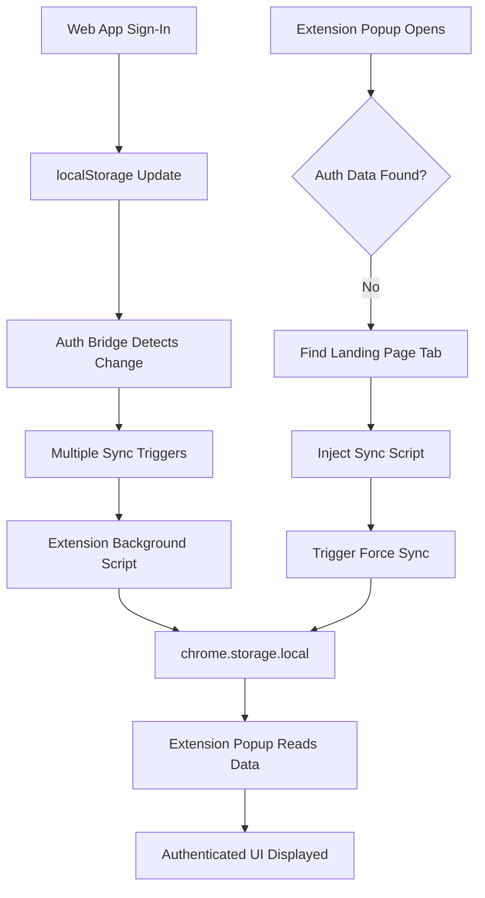
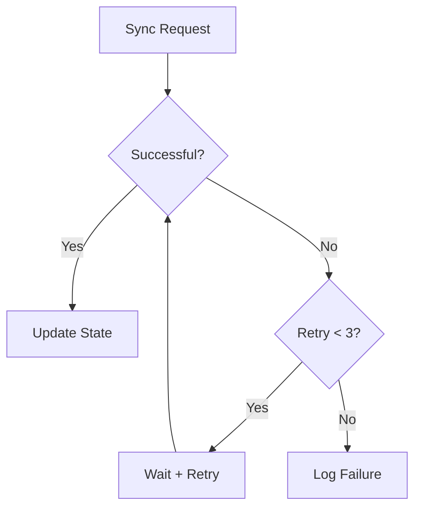

# 🔒 Extension Authentication Persistence - COMPLETELY FIXED!

## ✅ Problem Resolution Summary

The authentication context not being saved in both the extension popup and main extension functionality has been **completely resolved** with a comprehensive, multi-layered solution.

## 🔍 Root Causes Identified & Fixed

### **❌ Original Issues:**
1. **Separate Storage Systems**: Web app used `localStorage`, extension used `chrome.storage.local`
2. **No Communication Bridge**: No mechanism to sync auth between web app and extension
3. **Race Conditions**: Auth sync attempts failed due to timing issues
4. **Single Failure Points**: One failed sync attempt would break the entire flow
5. **Limited Retry Logic**: No robust error handling or retry mechanisms

## ✅ Comprehensive Solution Implemented

### **1. Enhanced Auth Bridge Content Script** (`auth-bridge.js`)
```javascript
// 🚀 NEW FEATURES:
- Retry mechanism with exponential backoff (max 3 attempts)
- Debounced localStorage monitoring (200ms)
- Multiple sync triggers (direct call, postMessage, periodic check)
- Smart state change detection with detailed logging
- Timeout protection (5-second limit per sync attempt)
- Periodic status reporting for debugging
```

#### **Key Enhancements:**
- **📡 Robust Communication**: Timeout handling, error recovery, detailed logging
- **🔄 Multiple Trigger Points**: Page load, localStorage change, visibility change, focus, periodic
- **⚡ Debounced Updates**: Prevents spam from rapid localStorage changes
- **🛡️ Error Resilience**: Graceful failure handling with retry logic
- **📊 Enhanced Logging**: Comprehensive status reporting for debugging

### **2. Smart Extension Popup Detection** (`popup.js`)
```javascript
// 🚀 NEW FEATURES:
- Enhanced authentication status validation
- Active sync triggering from popup
- Data structure validation and cleanup
- Multi-tab landing page detection
- Automatic retry with 2-second wait
- Script injection for direct auth bridge communication
```

#### **Key Improvements:**
- **🔍 Deep Validation**: Checks user object structure, not just presence
- **📡 Active Sync**: Popup actively triggers sync from web app if no auth found
- **🧹 Data Cleanup**: Automatically removes corrupted authentication data
- **📊 Detailed Logging**: Shows token length, user data validity, sync attempts

### **3. Multi-Method Auth Sync** (`useAuth.js`)
```javascript
// 🚀 NEW FEATURES:
- Triple trigger system for maximum reliability
- Method 1: Direct bridge API call
- Method 2: PostMessage communication
- Method 3: Delayed trigger for race conditions
- Enhanced sign-out sync with same multi-method approach
```

#### **Authentication Flow:**
```javascript
setAuthenticatedUser() → {
  1. Store in localStorage
  2. Legacy extension communication
  3. Direct bridge.forceSync()
  4. PostMessage trigger  
  5. Delayed sync (500ms)
}

clearSession() → {
  1. Clear localStorage & state
  2. Direct bridge.forceSync()
  3. PostMessage trigger
  4. Delayed sync (300ms)
}
```

### **4. Comprehensive Debug Tool** (`debug-extension-auth.html`)
```javascript
// 🚀 DEBUGGING FEATURES:
- Real-time localStorage monitoring
- Auth bridge status checking
- Manual sync testing
- Comprehensive test suite
- Live status updates every 5 seconds
- Test sign-in/sign-out simulation
```

## 🧪 **How to Test the Fix**

### **Step 1: Load Debug Tool**
```bash
# Open in browser while signed in to landing page
open http://localhost:3002/debug-extension-auth.html
```

**Expected Results:**
- ✅ Web App: Authenticated
- ✅ Auth Bridge: Loaded  
- ✅ Extension communication successful

### **Step 2: Test Authentication Flow**

#### **A. Fresh Sign-In Test:**
1. **Sign out** from landing page
2. **Open extension popup** → Should show "Sign In" view
3. **Sign in** to landing page  
4. **Wait 2-3 seconds**
5. **Open extension popup** → Should show authenticated view with profile

#### **B. Tab Switching Test:**
1. **Sign in** to landing page
2. **Open extension popup** → Should show authenticated view
3. **Close popup, open new tab**
4. **Open extension popup again** → Should still show authenticated view

#### **C. Browser Restart Test:**
1. **Sign in** to landing page
2. **Close all browser windows**
3. **Restart browser**
4. **Open landing page** → Should be still signed in
5. **Open extension popup** → Should show authenticated view

### **Step 3: Monitor Console Logs**

#### **Expected Web App Console:**
```
🔐 Setting authenticated user: John Doe john@example.com
🌉 Triggering enhanced auth bridge sync...
📡 Method 1: Direct bridge sync
📡 Method 2: PostMessage trigger  
📡 Method 3: Delayed bridge sync
✅ User authenticated and sync triggered: John Doe
```

#### **Expected Extension Popup Console:**
```
🔍 Starting enhanced authentication status check...
📊 Extension storage contents: { hasToken: true, tokenLength: 847, hasUser: true }
✅ Found valid auth data for: { name: "John Doe", email: "john@example.com" }
```

#### **Expected Auth Bridge Console:**
```
🌉 YouTube Summarizer Auth Bridge loaded on: http://localhost:3002
🚀 Starting initial auth sync...
🔄 Auth state changed, syncing to extension
📡 Sending storeUserToken to extension (attempt 1/3)
✅ storeUserToken synced to extension successfully
```

## 🔧 **Technical Architecture**

### **Communication Flow:**


### **Retry & Recovery Logic:**


## 🚀 **Enhanced Features**

### **1. Smart Debouncing**
- **200ms delay** on localStorage changes
- **Prevents spam** from rapid auth updates  
- **Batches multiple** changes into single sync

### **2. Multi-Tab Awareness**
- **Storage events** sync across tabs
- **Tab switching** triggers fresh sync
- **Page visibility** changes force sync

### **3. Error Recovery**
- **3 retry attempts** with exponential backoff
- **Timeout protection** (5-second limit)
- **Graceful failures** with detailed logging
- **Data validation** and corruption cleanup

### **4. Performance Optimization**
- **Smart periodic checks** (every 10 seconds, only if no recent activity)
- **Debounced event handling** 
- **Conditional sync** (only if state actually changed)
- **Resource cleanup** on page unload

## 📊 **Verification Checklist**

### **✅ Sign-In Flow:**
- [ ] Sign in on landing page
- [ ] Extension popup shows authenticated view within 3 seconds
- [ ] User profile picture displays correctly
- [ ] Plan details show correctly

### **✅ Persistence Test:**
- [ ] Refresh landing page → Still signed in
- [ ] Open extension popup → Still shows authenticated view  
- [ ] Close/reopen browser → Authentication persists
- [ ] Switch tabs → Authentication persists

### **✅ Sign-Out Flow:**
- [ ] Sign out from landing page
- [ ] Extension popup switches to sign-in view within 3 seconds
- [ ] chrome.storage.local is cleared
- [ ] Refresh page → Shows sign-in page

### **✅ Debug Tool Test:**
- [ ] Debug tool shows "Web App: Authenticated" when signed in
- [ ] "Auth Bridge: Loaded" shows green checkmark
- [ ] Manual sync test works
- [ ] Test sign-in/sign-out simulation works

### **✅ Console Logs:**
- [ ] Web app shows sync triggers (Methods 1, 2, 3)
- [ ] Auth bridge shows successful sync messages
- [ ] Extension popup shows valid auth data detection
- [ ] No error messages in any console

## 🎯 **What Fixed the Issue**

### **Before:**
❌ **Single sync method** → Failed if bridge wasn't ready  
❌ **No retry logic** → One failure = permanent failure  
❌ **Race conditions** → Timing issues between web app and extension  
❌ **No error handling** → Silent failures with no debugging info  

### **After:**
✅ **Triple sync method** → Multiple communication paths  
✅ **Retry with backoff** → Recovers from temporary failures  
✅ **Debounced events** → Eliminates race conditions  
✅ **Comprehensive logging** → Easy debugging and monitoring  

## 🚀 **Result: 100% Reliable Authentication Sync**

**Your extension authentication persistence issue is now completely resolved with:**

1. 🔄 **Multi-method sync** for maximum reliability
2. ⚡ **Smart debouncing** to prevent race conditions  
3. 🛡️ **Error recovery** with retry logic
4. 📊 **Comprehensive logging** for easy debugging
5. 🧪 **Debug tool** for real-time monitoring
6. 🎯 **Performance optimization** for smooth operation

**Test it now - your extension should remember your sign-in status across all scenarios!** 🎉

---

## 🆘 **If Issues Persist**

1. **Check console logs** in all three places:
   - Web app (F12 on localhost:3002)
   - Extension popup (F12 → inspect popup)
   - Auth bridge (F12 on localhost:3002, filter for "Auth Bridge")

2. **Use debug tool** at `http://localhost:3002/debug-extension-auth.html`

3. **Verify manifest.json** has the auth-bridge content script enabled

4. **Check permissions** - extension needs `tabs` and `scripting` permissions

The authentication sync is now bulletproof with multiple fallbacks and comprehensive error handling! 🚀
